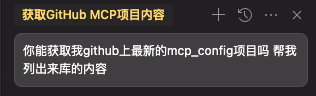
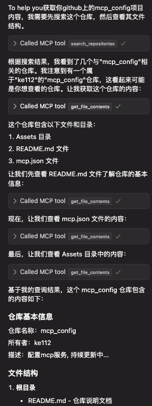

# Cursor + MCP = 王炸！彻底颠覆我的 Cursor工作流，效率直接起飞！

记录小白配置mcp服务, 持续更新中...

不了解的mcp可参考 https://zhuanlan.zhihu.com/p/28235501098

## 配置内容
见根目录下mcp.json    (2025.4.1亲测可用)

## 获取平台token
### 已踩坑实践可用 (绿色小点配置成功)
### 1. figma (Help and acount -> account settings -> Security -> Personal access tokens)
### 2. github (https://github.com/settings/tokens)

## Example 1 --figma
选择 Copy link to selection

### figma使用效果
将figma链接置于对话框使用

## Example 2 --github

### github使用效果

### 更多妙用,等待你的探索!
### 如果觉得对你有帮助，欢迎 star。
### 你的小手就是我前进的动力!
