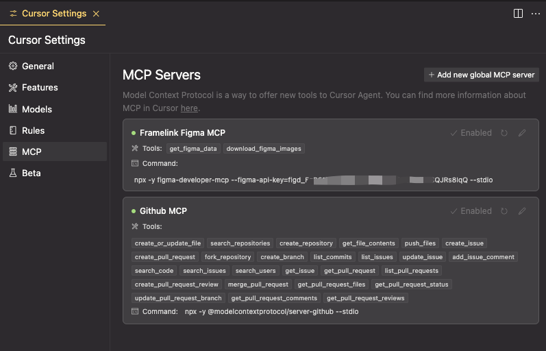
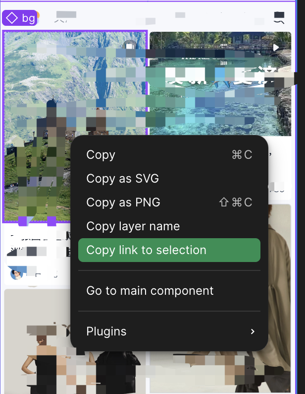
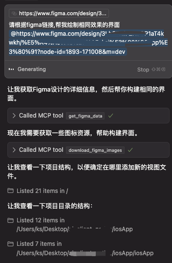

# mcp_config
小白配置mcp服务, 持续更新中...

## 集成平台
### 已踩坑实践可用 (绿色小点配置成功)
### 1. figma (Help and acount -> account settings -> Security -> Personal access tokens)
### 2. github (https://github.com/settings/tokens)

### 使用方式
选择 Copy link to selection

### 使用效果
将figma链接置于对话框使用

### 更多妙用,等待你的探索!
### 如果觉得对你有帮助，欢迎 star。
### 你的小手就是我前进的动力!
